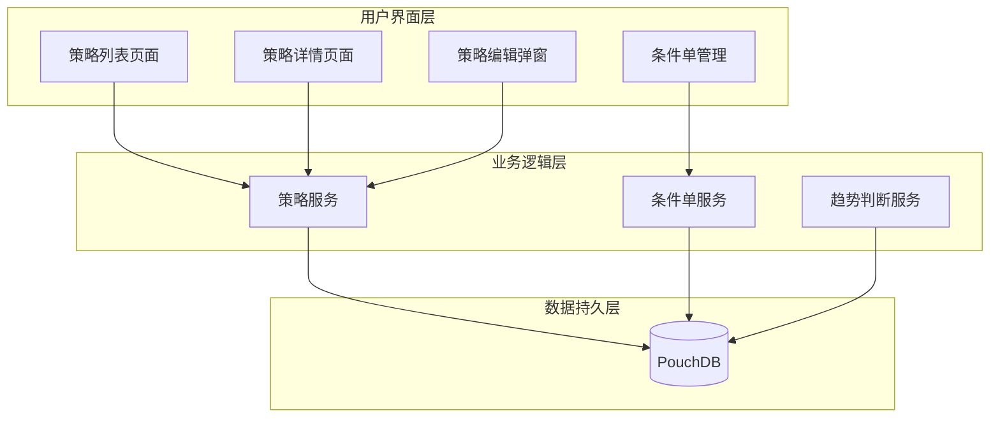
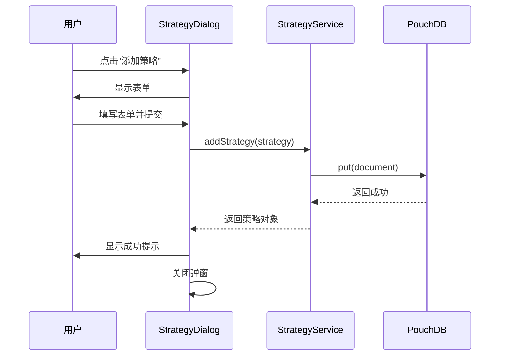
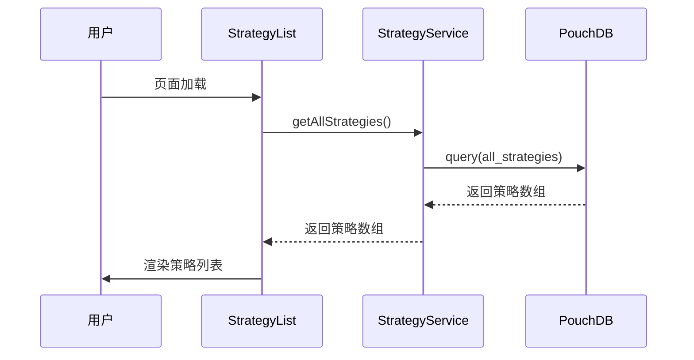

# my-quant 高级策略监控系统 - 设计文档

## 1. 项目概述

### 1.1 项目背景
本项目参考 vue-dialog-userscript 中的高级策略页面，在 my-quant 中构建一个独立的静态 Web 应用，用于股票量化交易策略的管理和监控。

### 1.2 核心目标
- 提供股票策略的增删改查功能
- 支持策略的分类管理（普通账户/信用账户）
- 实现趋势判断与可视化
- 支持条件单策略的管理
- 使用 PouchDB 作为本地数据库

### 1.3 技术栈
- **前端框架**: Vue 3 + Vite
- **数据库**: PouchDB
- **样式**: TailwindCSS 3
- **图标**: Lucide Icons

---

## 2. 架构设计

### 2.1 整体架构



### 2.2 模块划分

| 模块 | 职责 | 核心文件 |
|------|------|----------|
| **策略管理** | 策略的增删改查、分类展示 | `src/services/StrategyService.js` |
| **条件单管理** | 上涨加仓、下跌减仓策略管理 | `src/services/ConditionService.js` |
| **趋势判断** | 自动/手动趋势判断与存储 | `src/services/TrendService.js` |
| **数据存储** | PouchDB 数据库操作封装 | `src/utils/Database.js` |

---

## 3. 界面设计

### 3.1 页面结构

| 页面/组件 | 路径 | 功能描述 |
|-----------|------|----------|
| 首页/策略列表 | `/` | 展示所有策略，支持筛选和排序 |
| 策略编辑弹窗 | 模态框 | 添加/编辑策略信息 |
| 条件单管理 | 侧边栏/弹窗 | 管理上涨加仓和下跌减仓条件单 |
| 趋势分析 | 图表组件 | 展示股票趋势判断结果 |

### 3.2 主页面布局

```
┌─────────────────────────────────────────────────────────────┐
│  顶部导航栏                                                  │
│  ┌─────────────┬────────────────┬─────────────────────────┐ │
│  │  Logo       │ 搜索框          │ 操作按钮(添加/导入/导出) │ │
│  └─────────────┴────────────────┴─────────────────────────┘ │
├─────────────────────────────────────────────────────────────┤
│  筛选栏                                                      │
│  ┌─────────────┬─────────────┬─────────────┬─────────────┐ │
│  │ 账户类型     │ 趋势过滤     │ 排序方式     │ 列选择      │ │
│  └─────────────┴─────────────┴─────────────┴─────────────┘ │
├─────────────────────────────────────────────────────────────┤
│  策略列表表格                                                  │
│  ┌──────────┬──────┬────────┬────────┬─────────┬─────────┐ │
│  │策略名称   │ 股数  │ 市值    │ 盈亏%    │ 趋势判断  │ 操作   │ │
│  ├──────────┼──────┼────────┼────────┼─────────┼─────────┤ │
│  │ 普通账户分组...                                            │ │
│  ├──────────┼──────┼────────┼────────┼─────────┼─────────┤ │
│  │ 信用账户分组...                                            │ │
│  └──────────┴──────┴────────┴────────┴─────────┴─────────┘ │
└─────────────────────────────────────────────────────────────┘
```

### 3.3 策略编辑弹窗布局

```
┌─────────────────────────────────────────────────┐
│  标题栏: 添加/编辑高级策略                         │
├─────────────────────────────────────────────────┤
│  ┌─────────────┬─────────────┐                  │
│  │ 策略名称     │ [输入框]     │                  │
│  ├─────────────┼─────────────┤                  │
│  │ 账户类型     │ 普通/融资融券 │                  │
│  ├─────────────┴─────────────┤                  │
│  │ 震荡时网格大小: [输入框] 元                    │
│  │ 震荡时交易数量: [输入框] 股                    │
│  ├────────────────────────────┤                  │
│  │ 突破后网格大小: [输入框] 元                    │
│  │ 突破后交易数量: [输入框] 股                    │
│  ├────────────────────────────┤                  │
│  │ 下跌百分比: [输入框] %      │                  │
│  │ 减仓数量: [输入框] 股        │                  │
│  ├────────────────────────────┤                  │
│  │ 上涨百分比: [输入框] %      │                  │
│  │ 加仓数量: [输入框] 股        │                  │
│  ├────────────────────────────┤                  │
│  │ 市值: [输入框]              │                  │
│  │ 5年平均股息率: [输入框] %    │                  │
│  ├────────────────────────────┤                  │
│  │ 趋势判断: [下拉选择]         │                  │
│  │ 到期时间: [日期选择]         │                  │
│  ├────────────────────────────┤                  │
│  │ 手工备注: [文本域]           │                  │
│  │ 自动备注: [文本域] (只读)     │                  │
│  └────────────────────────────┘                  │
├─────────────────────────────────────────────────┤
│  [取消]                          [保存]         │
└─────────────────────────────────────────────────┘
```

---

## 4. 数据模型设计

### 4.1 策略数据模型 (Strategy)

| 字段名 | 类型 | 必填 | 说明 |
|--------|------|------|------|
| **id** | String | 是 | 策略唯一标识，UUID或时间戳 |
| **name** | String | 是 | 股票名称或策略名称 |
| **stockCode** | String | 是 | 股票代码 |
| **accountType** | String | 是 | 账户类型: 'default' \| 'credit' |
| **isMarginAccount** | Boolean | 否 | 是否融资融券账户 |
| **netPosition** | Number/String | 是 | 净持仓数量 |
| **marketValue** | String | 否 | 当前持仓市值 |
| **fiveYearAvgDividendYield** | Number/String | 否 | 五年平均股息率 |
| **trendJudgment** | String | 否 | 趋势判断: 'unset' \| 'unknown' \| 'up' \| 'down' \| 'oscillation' \| 'pullback' |
| **trendJudgmentUpdatedAt** | String | 否 | 趋势更新时间(ISO格式) |
| **expiryDate** | String | 否 | 策略到期日(YYYY-MM-DD) |
| **oscillationGridSize** | Number/String | 否 | 震荡网格间距(元) |
| **oscillationTradeAmount** | Number/String | 否 | 震荡网格交易数量(股) |
| **breakoutGridSize** | Number/String | 否 | 突破网格间距(元) |
| **breakoutTradeAmount** | Number/String | 否 | 突破网格交易数量(股) |
| **decreaseSide** | String | 否 | 下跌卖出方向: 'COLLSELL' \| 'SELL' \| 'MARGINSELL' |
| **decreaseStrategies** | Array | 否 | 下跌减仓策略列表 |
| **increaseStrategies** | Array | 否 | 上涨加仓策略列表 |
| **notes** | String | 否 | 自动生成备注 |
| **manualNotes** | String | 否 | 用户手工备注 |
| **createdAt** | String | 是 | 创建时间(ISO格式) |
| **updatedAt** | String | 否 | 更新时间(ISO格式) |

### 4.2 条件策略数据模型 (ConditionStrategy)

| 字段名 | 类型 | 必填 | 说明 |
|--------|------|------|------|
| **id** | String | 是 | 条件单唯一标识 |
| **strategyId** | String | 是 | 关联策略ID |
| **deltaPercentage** | Number/String | 否 | 价格变化百分比 |
| **deltaAmount** | Number/String | 否 | 价格变化金额 |
| **tradeVolume** | Number/String | 是 | 交易数量(股) |
| **side** | String | 是 | 交易方向: 'BUY' \| 'SELL' \| 'MARGINBUY' \| 'MARGINSELL' \| 'COLLSELL' |
| **createDate** | String | 是 | 创建日期 |
| **expiredTime** | String | 否 | 到期时间 |
| **status** | String | 否 | 状态: 'active' \| 'stopped' \| 'expired' |

### 4.3 数据库设计

#### 数据库名称
- `my_quant_strategies`

#### 文档类型

| 文档类型 | 前缀 | 说明 |
|----------|------|------|
| 策略 | `strategy_` | 存储策略主数据 |
| 条件单 | `condition_` | 存储条件单数据 |
| 趋势判断 | `trend_` | 存储趋势判断历史 |

---

## 5. 接口设计

### 5.1 策略服务接口 (StrategyService)

| 方法名 | 参数 | 返回值 | 说明 |
|--------|------|--------|------|
| **addStrategy** | `strategy: Object` | `Promise<Strategy>` | 添加新策略 |
| **updateStrategy** | `id: String, data: Object` | `Promise<Strategy>` | 更新策略 |
| **deleteStrategy** | `id: String` | `Promise<Boolean>` | 删除策略 |
| **getStrategyById** | `id: String` | `Promise<Strategy|null>` | 根据ID获取策略 |
| **getAllStrategies** | `filter?: Object` | `Promise<Strategy[]>` | 获取所有策略 |
| **getStrategiesByAccountType** | `accountType: String` | `Promise<Strategy[]>` | 按账户类型筛选 |
| **getStrategiesByTrend** | `trend: String` | `Promise<Strategy[]>` | 按趋势判断筛选 |

### 5.2 条件单服务接口 (ConditionService)

| 方法名 | 参数 | 返回值 | 说明 |
|--------|------|--------|------|
| **addCondition** | `condition: Object` | `Promise<Condition>` | 添加条件单 |
| **updateCondition** | `id: String, data: Object` | `Promise<Condition>` | 更新条件单 |
| **deleteCondition** | `id: String` | `Promise<Boolean>` | 删除条件单 |
| **getConditionsByStrategyId** | `strategyId: String` | `Promise<Condition[]>` | 获取策略关联的条件单 |
| **stopCondition** | `id: String` | `Promise<Boolean>` | 停止条件单 |

### 5.3 趋势服务接口 (TrendService)

| 方法名 | 参数 | 返回值 | 说明 |
|--------|------|--------|------|
| **updateTrendJudgment** | `strategyId: String, trend: String` | `Promise<Boolean>` | 更新趋势判断 |
| **getTrendHistory** | `strategyId: String` | `Promise<Object[]>` | 获取趋势历史 |

---

## 6. 页面路由设计

| 路由路径 | 组件 | 功能 |
|----------|------|------|
| `/` | `StrategyList.vue` | 策略列表主页 |
| `/strategy/:id` | `StrategyDetail.vue` | 策略详情页 |

---

## 7. 核心组件设计

### 7.1 StrategyList.vue - 策略列表组件

**功能**: 展示所有策略列表，支持筛选、排序、列选择

**props**: 无

**events**:
- `edit-strategy`: 编辑策略
- `delete-strategy`: 删除策略
- `add-strategy`: 添加策略

### 7.2 StrategyRow.vue - 策略行组件

**功能**: 展示单条策略信息

**props**:
- `strategy`: Strategy 对象

**events**:
- `edit`: 编辑
- `delete`: 删除
- `update-trend`: 更新趋势
- `batch-condition`: 批量条件单

### 7.3 StrategyDialog.vue - 策略编辑弹窗

**功能**: 添加/编辑策略表单

**props**:
- `show`: Boolean - 显示/隐藏
- `isEditing`: Boolean - 是否编辑模式
- `strategy`: Object - 策略数据

**events**:
- `close`: 关闭弹窗
- `save`: 保存策略

### 7.4 ConditionPanel.vue - 条件单管理面板

**功能**: 管理上涨加仓和下跌减仓条件单

**props**:
- `strategies`: Strategy[] - 策略列表

**events**:
- `update-condition`: 更新条件单

---

## 8. 状态管理

### 8.1 全局状态

| 状态名 | 类型 | 初始值 | 说明 |
|--------|------|--------|------|
| **strategies** | Array | [] | 所有策略列表 |
| **selectedStrategy** | Object | null | 当前选中策略 |
| **filterAccountType** | String | 'all' | 账户类型过滤 |
| **filterTrend** | String | 'all' | 趋势过滤 |
| **sortBy** | String | 'name' | 排序字段 |
| **sortOrder** | String | 'asc' | 排序方向 |

### 8.2 本地存储

| 存储键 | 说明 |
|--------|------|
| `strategyFilterAccountType` | 账户类型过滤状态 |
| `strategyFilterTrend` | 趋势过滤状态 |
| `strategySortBy` | 排序字段 |
| `strategySortOrder` | 排序方向 |
| `strategyVisibleColumns` | 可见列配置 |

---

## 9. 安全性考虑

### 9.1 数据安全
- 数据库数据仅存储在本地浏览器中
- 支持数据导出/导入功能
- 定期数据备份提醒

### 9.2 输入验证
- 所有用户输入进行类型检查
- 数值字段限制有效范围
- 特殊字符过滤

---

## 10. 部署与集成

### 10.1 构建配置
- 使用 Vite 构建静态资源
- 输出目录: `dist/`

### 10.2 运行方式
- 开发环境: `npm run dev`
- 生产构建: `npm run build`
- 预览构建: `npm run preview`

---

## 11. 代码目录结构

```
src/
├── components/
│   ├── StrategyList.vue      # 策略列表组件
│   ├── StrategyRow.vue       # 策略行组件
│   ├── StrategyDialog.vue    # 策略编辑弹窗
│   ├── ConditionPanel.vue    # 条件单管理面板
│   ├── TrendFilter.vue       # 趋势过滤组件
│   └── ColumnSelector.vue    # 列选择组件
├── services/
│   ├── StrategyService.js    # 策略服务
│   ├── ConditionService.js   # 条件单服务
│   └── TrendService.js       # 趋势服务
├── utils/
│   ├── Database.js           # PouchDB 封装
│   └── helpers.js            # 辅助函数
├── App.vue                   # 根组件
├── main.js                   # 入口文件
└── style.css                 # 全局样式
```

---

## 12. 数据流程图

### 12.1 添加策略流程



### 12.2 查询策略流程



---

## 13. 开发计划

### 阶段一：基础框架搭建
- 初始化 Vue 3 + Vite 项目
- 配置 TailwindCSS 3
- 安装 PouchDB 和 Lucide Icons

### 阶段二：数据库层实现
- 实现 Database.js 工具类
- 定义数据库初始化逻辑

### 阶段三：服务层实现
- 实现 StrategyService
- 实现 ConditionService
- 实现 TrendService

### 阶段四：组件开发
- 开发 StrategyList 组件
- 开发 StrategyRow 组件
- 开发 StrategyDialog 组件
- 开发 ConditionPanel 组件

### 阶段五：集成测试
- 测试数据增删改查功能
- 验证筛选排序功能
- 测试条件单管理功能

### 阶段六：部署上线
- 构建生产版本
- 配置静态资源托管