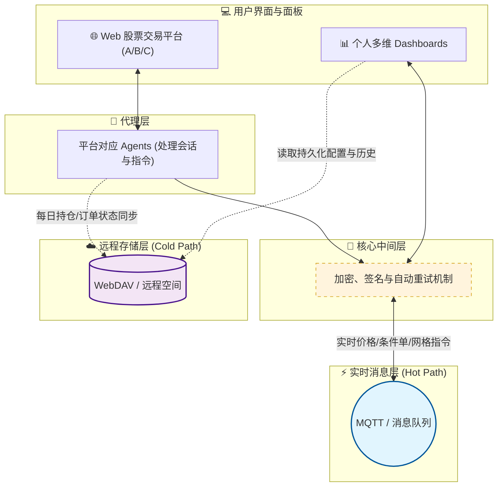
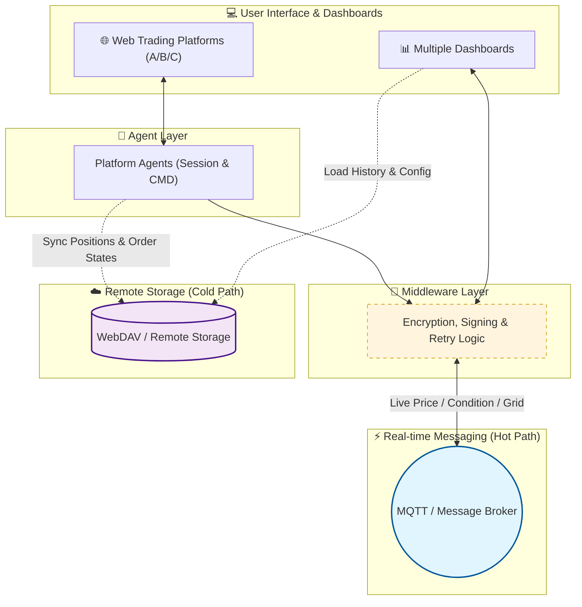

# my-quant

## Prompt for the chart
我要画一个github中的readme的图，它是一个股票量化交易平台
它包含多个web在线股票交易平台，这些平台所对应的agent，以及我自己的多个dashboard
对于实时股票价格数据，条件单以及网格交易创建请求，它通过中间层通过加密及重试等，发送到底层mqtt或者其他消息平台发送接收消息来更新数据
对于并不是那么实时的数据，比如每日开盘时的持仓，已设定条件单，网格交易订单等，它通过webdav等远程存储空间进行同步及更新
请帮我写一个这样的图

